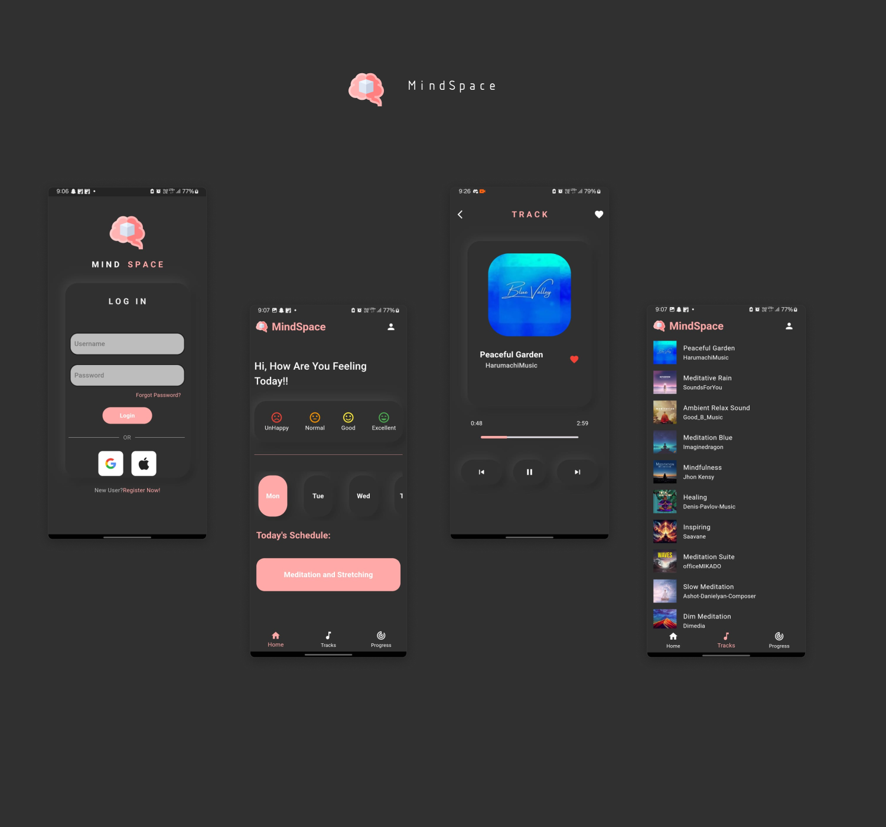

# Mindspace

Mindspace is a mindfulness and meditation application designed to enhance mental well-being and promote relaxation through guided meditation sessions and soothing music tracks. This app aims to provide users with an immersive experience tailored to their emotional states, helping them achieve a more balanced and peaceful mind.

# Features
Personalized Meditation Sessions: 
Users can select from various meditation tracks tailored to their preferences and emotional states.

Progress Tracking: 
  Monitor meditation time, completed sessions, and streaks to motivate and encourage users on their mindfulness journey.

Real-time Notifications: 
  Set reminders for daily meditation practice, ensuring users maintain their mindfulness routine.

Engaging UI:
  A clean and user-friendly interface designed for seamless navigation and an enjoyable experience.

# Technology Stack
Flutter: 
  For building a cross-platform mobile application.
  
Firebase: 
  Used for real-time database functionalities, authentication, and file storage.

Audio Players: 
  For playing soothing music tracks during meditation sessions.

# Contributing
Contributions are welcome! Please feel free to open an issue or submit a pull request.

# License
This project is licensed under the MIT License.
